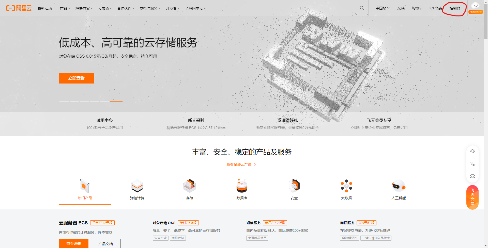
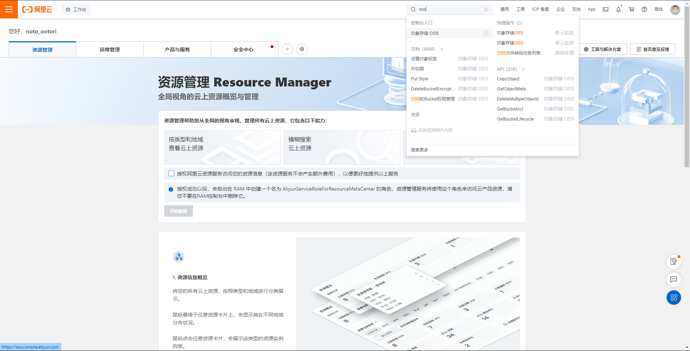
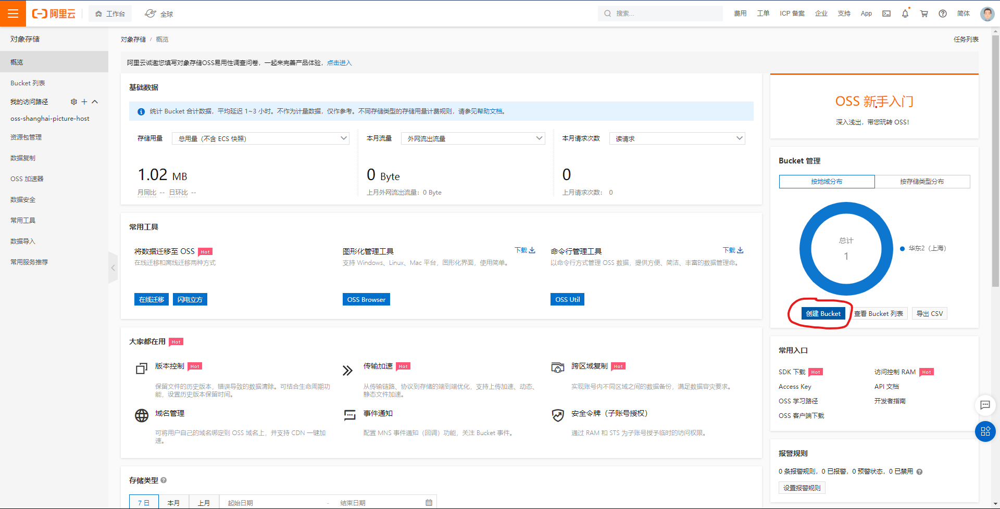
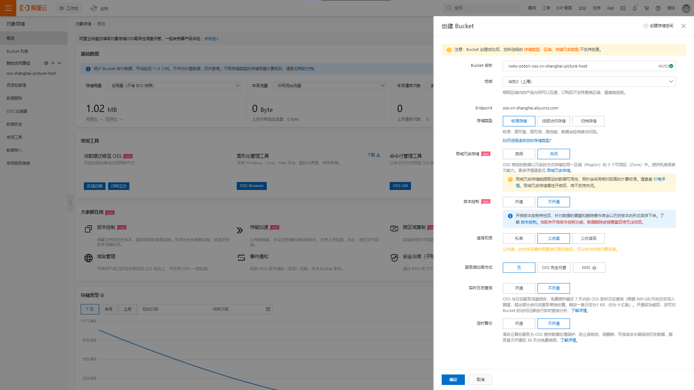
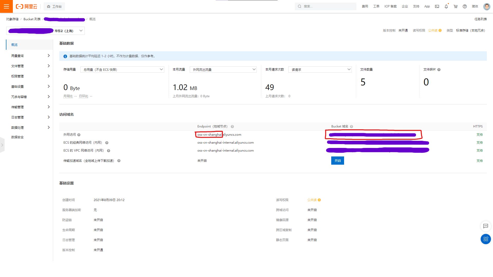
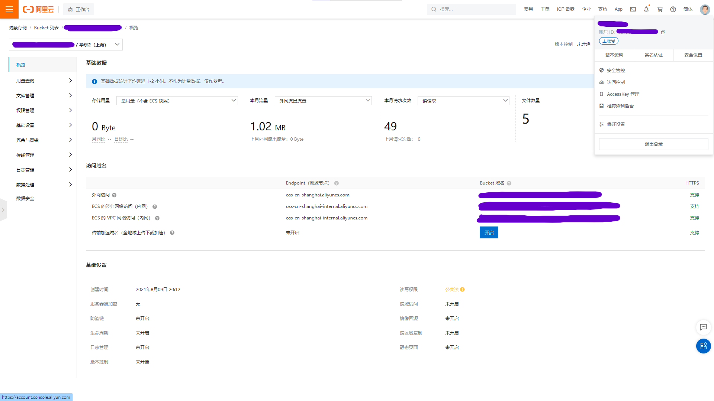
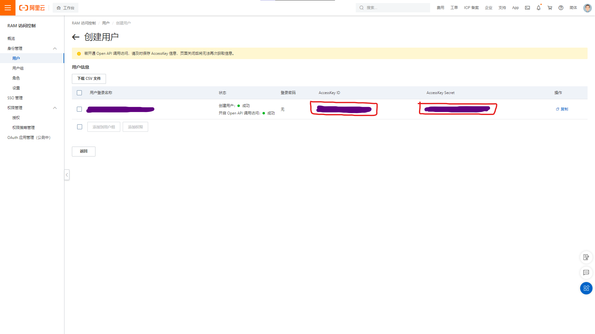
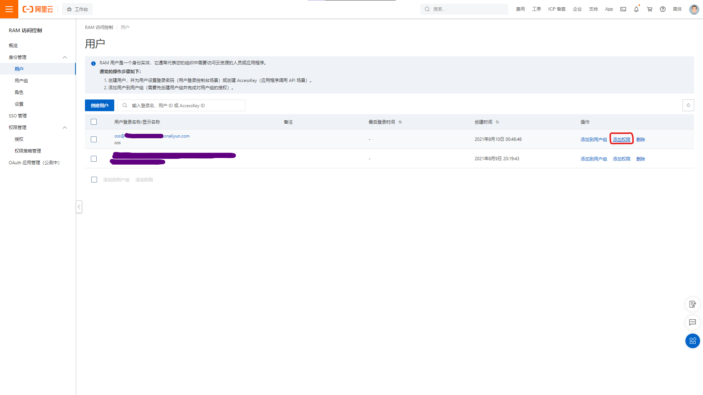
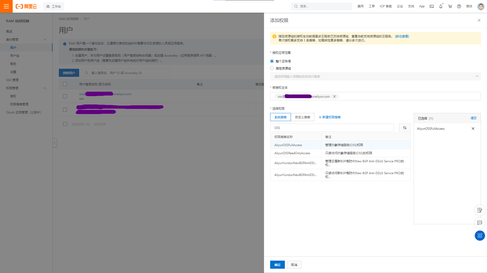
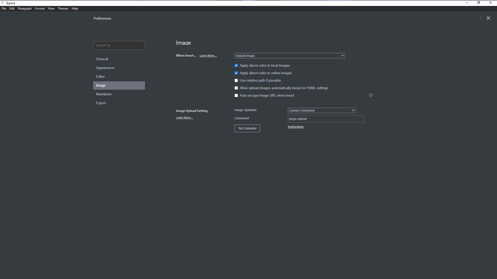

本文使用的操作系统为 Windows.

## 阿里云 OSS 购买

我们在阿里云上购买对象存储服务 (OSS), 并以此作为我们的图床.

1. 登录阿里云. 如果没有注册的话先注册, 注册的流程这里就略过了.

2. 点击 "控制台", 找到 "对象存储 OSS", 并开通服务.
   
   

3. 点击 "概览", 并点击 "创建 Bucket". 按照图中示例填写好创建 Bucket 所需的信息, 其中要注意的是 "读写权限" 应为 "公共读", "Bucket 名称" 以及 "地域" 按照自己喜好填写, 其余服务均可以选择不开启.
   
   

4. 创建完成后, 我们还要记录一下相关信息, 以便之后使用. 首先找到这个新建的 Bucket 的概览, 记下由图中红框标示的地域代号和 "外网访问 Bucket 域名".
   

5. 接着鼠标悬浮在右上角头像上, 点击 "AccessKey 管理", 安全提示时点击 "开始使用子用户 AccessKey", 或者通过其它方式进入 "RAM 访问控制". 在 "身份管理 &ndash; 用户" 中点击 "创建用户", 勾选 "Open API 调用访问". 创建成功后**立即**记录下 AccessKey ID 和 AccessKey Secret, 要注意**页面关闭后将无法再次获取信息**. 最后给该用户设置 "管理对象存储服务 (OSS) 权限". 这样在阿里云上的操作就告一段落了.
   
   
   
   
   
   

## 安装并配置 PicGo-Core

[PicGo-Core](https://github.com/PicGo/PicGo-Core)([文档](https://picgo.github.io/PicGo-Core-Doc/)) 是一款命令行图片上传工具, 我们以此将本地图片上传到图床上并获取访问链接.

1. 下载安装 [nvm for Windows](https://github.com/coreybutler/nvm-windows).
2. 安装 PicGo-Core.

   ```shell
   npm install picgo -g # or `yarn global add picgo`
   ```

3. 配置 PicGo-Core 所使用的 Uploader.

   ```shell
   picgo set uploader # configure an uploader
   picgo use uploader # select an uploader to use
   ```

   - accessKeyId: 之前记录下的用户的 "AccessKey ID".
   - accessKeySecret: 之前记录下的用户的 "AccessKey Secret".
   - bucket: 创建 Bucket 时所填写的 "Bucket 名称".
   - area: Bucket 概览中的地域代号.
   - path: 设置上传的图片在云中所存储的路径, 可以设为空.
   - customUrl: Bucket 概览中的 "外网访问 Bucket 域名".
   - options: 针对图片的一些后缀处理参数 PicGo 2.2.0+ PicGo-Core 1.4.0+, 我们设为空就可以了.

4. 现在 PicGo-Core 已经可以使用了, 尝试一下吧!

   ```shell
   picgo upload # upload the image in clipboard
   picgo upload <filename> # upload <filename>
   ```

5. 给 PicGo-Core 添加插件, [Awesome-PicGo](https://github.com/PicGo/Awesome-PicGo) 中列举了现有的插件, 去挑选想用的吧. 例如我们不希望上传到图床的图片保留原来的文件名 (这样文件名容易重复, 而重复的时候旧的图片就会被覆盖), 就可以用 [picgo-plugin-rename-file](https://github.com/liuwave/picgo-plugin-rename-file) 插件来自动重命名图片.

   ```shell
   picgo install picgo-plugin-rename-file # install plugin
   picgo set plugin # configure plugin
   ```

## 配置 Typora

按照下图配置 Typora 即可完成图片拖入自动上传啦!


## 参考资料

1. <https://zhuanlan.zhihu.com/p/138878534>
